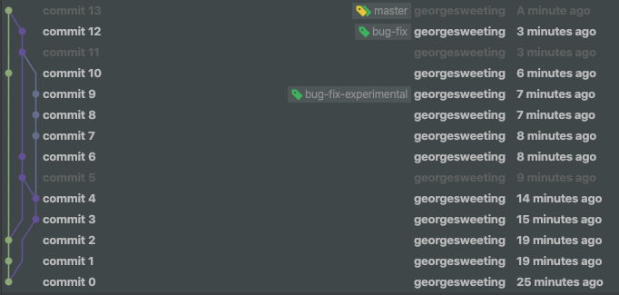

#Commands
git init 
git commit -m "commit 0" 
git branch bug-fix 
git commit -am "commit 1" 
git commit -am "commit 2" 
git checkout bug-fix 
git commit -am "commit 3" 
git commit -am "commit 4" 
git branch bug-fix-experimental 
git merge master 
git commit -am "commit 5" 
git commit -am "commit 6" 
git checkout bug-fix-experimental 
git commit -am "commit 7" 
git commit -am "commit 8" 
git commit -am "commit 9" 
git checkout master 
git commit -am "commit 10" 
git checkout bug-fix 
git merge bug-fix-experimental 
git commit -am "commit 11" 
git commit -am "commit 12" 
git checkout master 
git merge bug-fix 
git commit -am "commit 13" 
git commit -am "commit 14" 
git add src/commits.png 

#Image

